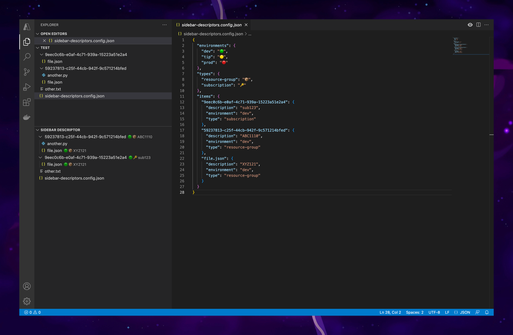

# vscode-explorer-descriptions

Allow to define descriptions and comments for files and folders to show on a sidebar explorer.


## usage

This extension requires a file `explorer-descriptions.config.json` to be added to your project, with the following structure:


```json
{
  "environments": {
    "dev": "🟢",
    "tip": "🟡",
    "prod": "🔴"
  },
  "types": {
    "config-file": "📄️",
    "resource-group": "📦️",
    "subscription": "🔑️"
  },
  "items": {
    "59237813-c25f-44cb-942f-9c571214bfed": {
      "comments": "this are just some comments",
      "description": "MAIN SUB",
      "environment": "dev",
      "type": "subscription"
    },
    "9eec0c6b-e0af-4c71-939a-15223a51e2a4": {
      "description": "RG A",
      "type": "resource-group",
      "environment": "dev"
    },
    "db509caa-57a2-4e46-b445-dd8555d66b63": {
      "description": "RG B",
      "type": "resource-group",
      "environment": "dev"
    },
    "deploy.json": {
      "description": "deploy configuration",
      "type": "config-file"
    }
  }
}
```

### enviroments / types

This dictionaries are used to show different indicators next to the description of an item.

### items

Collection of identifiers to be used to match with the names of the folders/files in the project. 

* **description (required)**: description of the item associated with the identifier.
* **comments (optional)**: extended description that will be shown in the tooltip of the item.
* **environment (optional)**: environment in which the item runs.
  * it will look for an indicator within the **environments** section to show right next to the description.
* **type (optional)**: type of the item.
  * it will look for an indicator within the **types** section to show right next to the description.


